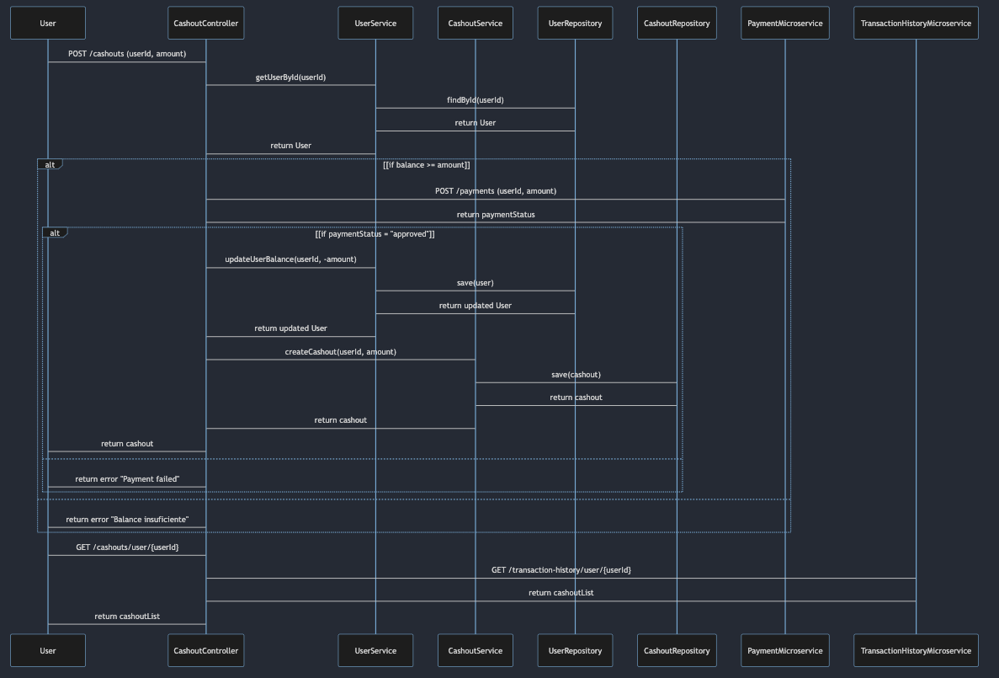

# Final Java Reactivo

El proyecto consiste en un servicio que realiza el manejo de transacciones para los usuarios aplicando validación de los egresos verificando balance disponible y mostrando las correspondientes excepciones, este proyecto esta realizado en spring webFlux con base de datos en mongo (Atlas)

# Estructura del Proyecto

* Controladores: Definen los endpoints de la API.
* Servicios: Implementan la lógica de negocio.
* Modelos: Definen las estructuras de datos utilizadas en la aplicación.
* Excepciones: Definen las excepciones personalizadas.
* Pruebas: Contienen las pruebas unitarias y de integración.

# Diagrama de secuencia

